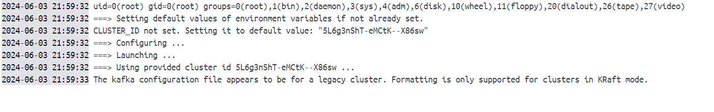
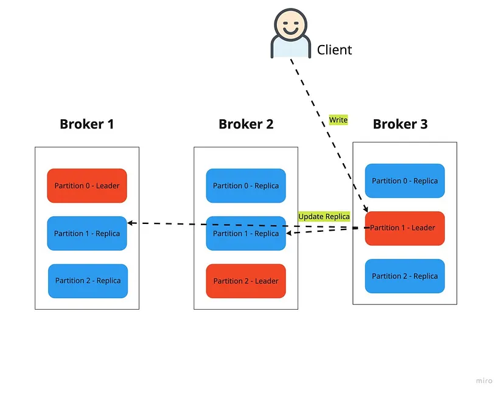
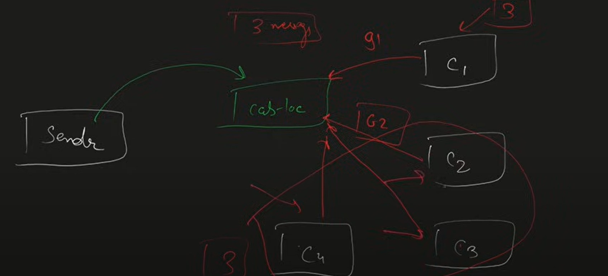

# spring-boot-with-kafka
Spring Boot with kafka

```https://cwiki.apache.org/confluence/display/KAFKA/KIP-975%3A+Docker+Image+for+Apache+Kafka```

```https://medium.com/@jackie.trang18/kafka-for-dummies-and-with-practical-failure-experiments-4a1ac6cd78d0```

### Install and Running the kafka in local 
1. [Download the kafka latest version from the Url](https://kafka.apache.org/downloads)
2. Run the zookeeper Server by using below command
    ```.\bin\windows\zookeeper-server-start.bat .\config\zookeeper.properties```
   if you are facing the using with amx line length edit the ```kafka-run-class.bat``` inside the windows folder as below
   from ```rem Classpath addition for release
   for %%i in ("%BASE_DIR%\libs\*") do (
   call :concat "%%i"
   )```
   to ```rem Classpath addition for release
   call :concat "%BASE_DIR%\libs\*;"```
3. Run the kafka Server using the below command
   ```.\bin\windows\kafka-server-start.bat .\config\server.properties```

apache/kafka:<tag> docker image will support only in kraft mode it Will not works with zookeeper.




**Cluster** : A group of computers or machines or servers, which serves for a common task.

**Replication Factor** : Based on the Replication factor value, it will maintain those many replicas in the cluster. In this case, the topic is split into three partitions, evenly distributed into three brokers. Each partition has two other replicas, also distributed across all brokers, but this is from a different setting called replication factor.


**Offset** : Each message in a topic has a unique identifier called offset.

**Kafka Consumer Group** : 
Scenerio 1 : A consumer group contains only one consumer
    If a sender sents the 3 messages to kafka Topic, all the 3 messages proceed by only one consumer.
Scenerio 2 : A cosumer group contains multiple consumers here in case 3 consumers.
    If a sender sents the 3 messages to kafka topic, all the 3 messages proceed by three consumers where each consumer can process only one messgage.

for more details read below article.
```https://medium.com/javarevisited/kafka-partitions-and-consumer-groups-in-6-mins-9e0e336c6c00```




Maven command to export locally build jar to local maven repo

mvn install:install-file -Dfile=.\kafka-models\target\kafka-models-1.0-SNAPSHOT.jar -DgroupId=com.example -DartifactId=kafka-models -Dversion=1.0-SNAPSHOT -Dpackaging=jar
